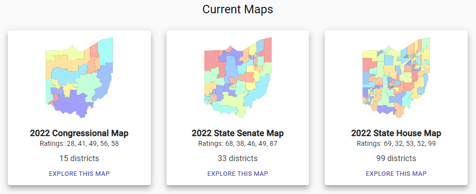

```{r setup, include=FALSE}
knitr::opts_chunk$set(echo = FALSE)
```


```{r include=FALSE}
library(tidyverse)
df <- read_csv("analysis_data")
```

## Problem

- Investigating the affects of states' redistricting stance on voter turnout.


<center>

</center>

## 
<center>

</center>

## 
<center>

</center>

## Problem

 - "Redistricting" in the US - normal, decennial process through states redraw the boundaries of  districts

 - Concerns about fairness (In a perfect world, the lines would be drawn in the fairest way possible. But even that is hard to measure and execute, depending on your version of "fair")

 - How the lines are drawn might influence election outcomes.(There is very little guidance and even fewer rules about what the line-drawing process is supposed to be, and the lines can easily be drawn to favor your party over the other.)
 
- Recent increase in partisan polarization, role of redistricting (The "guardrail" of democratic behavior usually meant moderate gains losses during redistricting, knowing your party might not be in power in 10 years. But recently, tactics have grown fiercely partisan in many cases).

## 
<center>
{width=35%}
</center>

## Terminology

- Following the decennial census, each state is required by federal law to redraw their districts.

- Each state has its own process for drawing new congressional districts after a census. Most states’ policies can fall into one of two groups: partisan or non-partisan.

- The majority of states rely on legislatures, and thus the party in control at the state level, to draw the news districts, with little oversight or judicial involvement. Other states have made laws that force the redistricting process to be done by an outside commision.

- 


 - Legislature
 - Commission
 - Courts
 - Exceptions (single-district states, etc)
 <center>
 ```{r}
 # ggplot(df) +
 #    geom_waffle(aes(Drawn.by))
 ```
</center>


</center>

##Background


</center>

- Hayes and Mckee (2009; 2011) used precinct level election data for five states from 1992 to 2006, finding that the negative effects on participation are highest among African Americans.

- Best and Lem (2021) analyzed data from 3 states with independent commissions and 4 states with other types of commissions in the 2010 redistricting, finding that three of seven commissions produced redistricting results benefiting one party.


</center>


##Theory

- Non-partisan redistricting methods should lead to higher turnout.


</center>


## Data Sources


### 1. Congressional election data, 2000-2020
- MIT Election Lab
- Level: Congressional District

### 2. Redistricting policies by state, 2000-2020
- 

### 3. US Census turnout

</center>


</center>

## Data cleaning and merging

- Drop with states with only one district

- [Redistricting cleaning]

- 


</center>


