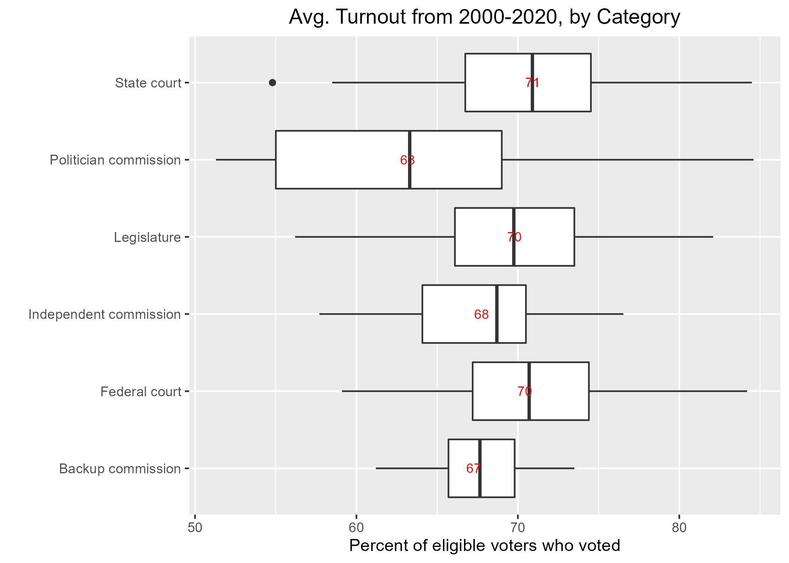
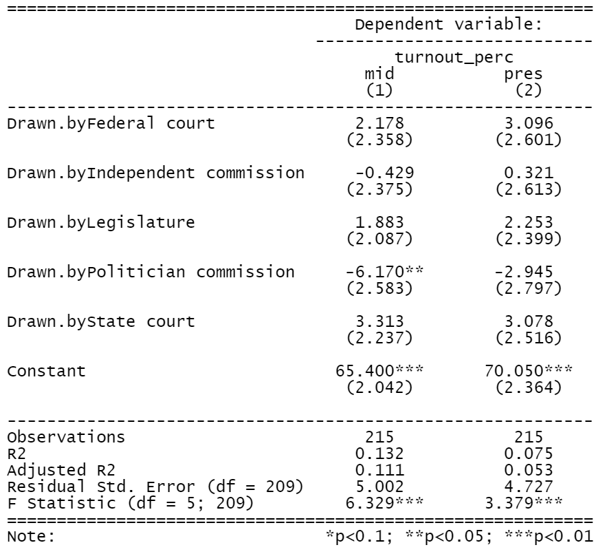
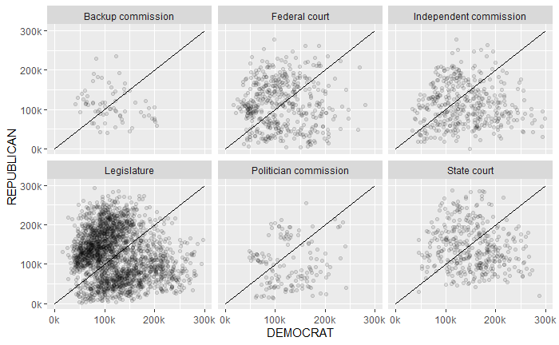

```{r setup, include=FALSE}
knitr::opts_chunk$set(echo = FALSE)
```

```{r include=FALSE}
library(tidyverse)
df <- read_csv("analysis_data.csv")
```

## Intro: Redistricting vs. Gerrymandering

Redistricting:

-   Part of the constitution, designed to ensure fair representation
-   Based on results of decennial census
-   All states with more than 1 district redraw their maps
-   Traditionally done by state legislatures
-   Generally speaking, vote share should be close to seat share


Gerrymandering:

-   Almost as old as the constitution itself
-   Drawing districts in peculiar ways to gain political advantage
-   Party in power can entrench itself to maintain power

## Gerrymandering Examples


<center>

{width=25% height=20%}

Example Districts (40% Yellow Voters, 60% Blue Voters):


</center>

## Research questions

1.   Do non-partisan redistricting methods lead to closer vote margins in Congressional elections?

2.   Is there a correlation between the institution that draws the maps and voter turnout?


## 

 (source: DavesRedistricting.org)


## Terminology

-   "Redistricting" - The redrawing of legislative district lines following the census in order to accommodate population shifts and keep districts as equal as possible.

*   Each state has its own institution for drawing new congressional districts after a census:

    +   Legislature

    +   Commission (Politican, Independent)

    +   Courts (Federal, State)

    +   Exceptions (single-district states, etc)

-   Partisan vs Non-partisan redistricting - State legislatures or third-parties have control and can arrange electoral districts

## State by State stance

<center>
{width=80%}
</center>

## Background and Theory

-   Hayes and Mckee (2009; 2011) found strong effects in participation among black Americans

-   Best and Lem (2021) found that three of seven states analyzed favored a single party

-   Hypothesis: Nonpartisan redistricting methods should lead to higher turnout


## Data Sources

-   Congressional election data, 2000-2020

    -   via MIT Election Lab Level: Congressional District

-   Redistricting policies by state, 2000-2020

    -   via Loyola Law School
    -   CSV file that includes information about how each state's method of redrawing electoral district lines
    -   columns include: state, seats, legal default, last drawn by, and control

-   US Census turnout

    -   US Census Bureau: Voter registration and turnout, 1972-2020

## Data cleaning and merging

-   Election: Drop with states with only one district (AK, DE, MT, ND, SD, VT, WY)

-   Redistricting data: (Identifying states that redrew their district maps between censuses to create state-year-drawing institution observations)

-   Locating required tables nested within 'printer-friendly' spreadsheet

-   Merge on State-year pairs


## Methods

-   Graphs

-   Regression 1: Turnout (presidential vs midterm elections)

-   Regression 2: Margins

## Box plot - turnout percentage by stance
<center>
{width=70%}
</center>

## Results

-   Regression
<center>
{width=80%}
</center>

## Margin
<center>
{width=100%}
</center>