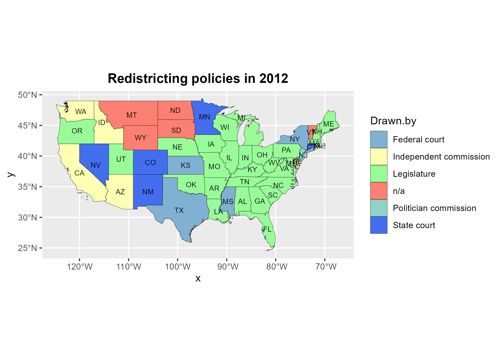
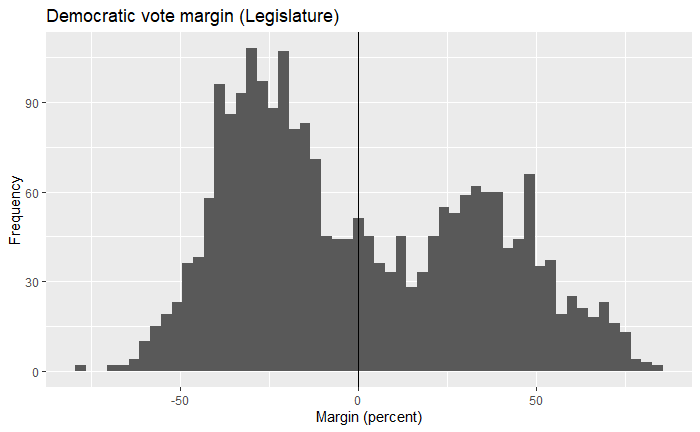

```{r setup, include=FALSE}
knitr::opts_chunk$set(echo = FALSE)
```

```{r include=FALSE}
library(tidyverse)
df <- read_csv("analysis_data.csv")
```

## Intro: Redistricting vs. Gerrymandering

Redistricting:

-   Part of the constitution, designed to ensure fair representation
-   Based on results of decennial census
-   All states with more than 1 district redraw their maps
-   Traditionally done by state legislatures
-   Generally speaking, vote share should be close to seat share

</br>

Gerrymandering:

-   Almost as old as the constitution itself
-   Drawing districts in peculiar ways to gain political advantage
-   Party in power can entrench itself to maintain power

## Gerrymandering Examples


<center>

{width=25% height=20%}

Example Districts (40% Yellow Voters, 60% Blue Voters):


</center>

## Research questions

1. Is there any statistically significant relationship between the redistricting institution and turnout in Congressional elections? Specifically, do partisan methods lead to lower turnout?

2. Do partisan redistricting methods lead to more lopsided races - larger vote margins?

  


## 


<br/>
(source: DavesRedistricting.org)


## Terminology

-   "Redistricting" - The redrawing of legislative district lines following the census in order to accommodate population shifts and keep districts as equal as possible.

*   Each state has its own institution for drawing new congressional districts after a census:

    +   Legislature

    +   Commission (Politican, Independent)

    +   Courts (Federal, State)

    +   Exceptions (single-district states, etc)

-   Partisan vs Non-partisan redistricting - State legislatures or third-parties have control and can arrange electoral districts

## State-wise redistricting policies

<center>
{width=100%}
</center>

## Background and Hypothesis

* Prior research showed evidence that partisan commissions produced unfair maps
  -   Hayes and Mckee (2009; 2011) found strong negative effects in participation among African Americans

  -   Best and Lem (2021) found that independent commissions (CA, WA) produced 'fairer' maps, compared to other commissions (AZ).

-   Hypothesis: Nonpartisan redistricting methods should lead to higher turnout

-   Our second hypothesis did not easily present a statistical method for testing.

## Data Sources


-   Redistricting policies by state, 2000-2020

    -   Loyola Law School
    -   State-level, information about each state's method of redrawing electoral district lines and dates
    -   columns include: state, seats, legal default, last drawn by, and control

-   US Census turnout

    -   US Census Bureau: Voter registration and turnout, 1972-2020
    -   State-level
    
-   Congressional election data, 2000-2020

    -   MIT Election Lab Level
    -   District-level, vote totals for each candidate/party

## Data cleaning and merging

-   Drop with states with only one district (AK, DE, MT, ND, SD, VT, WY). Restrict to 2000-2020 range.

-   Redistricting data: Identifying states that redrew their district maps between censuses.

-   Turnout: Locating required tables nested within 'printer-friendly' spreadsheet

-   Merge redistricting and turnout (one-to-one) on State-year pairs. Then merge this with district-votes


## Methods

-   Visualization and descriptive analyses

-   OLS Regression: Turnout on policy

-   Panel regression: Include state and year fixed effects


## Box plot - turnout percentage by stance

- Politician commission had the lowest mean. Next, legislature-drawn states saw the lowest turnout values.

- The lowest values of turnout are seen for partisan mechanisms.

<center>

{width=70%}
</center>

## Lineplot - trends through time

<center>

{width=70%}
</center>


## OLS Regression: Specification


- For each observation (state-election), policy is an unordered categorical variable.

- We run a model with all observations, and include a dummy variable for midterm years. 

    $y_{i} = \beta_0 + \beta_1 Policy_{i} + \beta_2 Midterm_{i} + \epsilon_{i}$


- We then run the model separately for each election type (midterms vs presidential), without the midterm dummy.

## OLS Regression: Results

<center>
{width=70%}
</center>

- Lower turnout in midterms

- Politician commission has the most negative, while State Court has the most positive effects.


## OLS Regression: Results


<center>

{width=70%}
</center>


## Panel regression: fixed effects

- States and years have different characteristics that may affect the response variable (unobserved heterogeneity).

- Observations are correlated over time, error terms will be autocorrelated. Idiosyncratic effects with time.

- Panel model with fixed effects for the state and year variables.


  $y_{it} = \beta_{i} + \beta_1 Policy_{it} +  \beta_2 year_t + \epsilon_{it}$ 
  
- Where \
$y_{it} =$ Turnout percentage for state i in year t \
$x_{it} =$ Binary variable for policy (court, legislature or partisan) \
$\beta_{i} =$ Intercept/fixed effect for state i \
$year_t =$ Intercept/fixed effect for year t \
$\epsilon_{it} =$ Error term
      
      
## Panel regression: results

- Partisan redistricting mechanisms associated with lower turnout, court with higher. 

- Robust to state and year effects.

- Goodness of fit for fixed-effect models needs to be calculated separately. (Endsley 2016)


<center>

{width=50%}

</center>

## Exploring vote margins

- The following plots Republican and Democratic Votes for each district from 2000-2020, faceted by redistricting policy of the state.

- Clustering in legislature
<center>
{width=100%}
</center>

## Vote margins: Distribution

- We calculate the Democratic vote margin (in percent).

- Plot histogram for states with Legislature redistricting.
<center>
{width=100%}
</center>

## Future Research

-  Control variables like demographics. 

-  Stronger causal inference methods, like difference-in-differences.