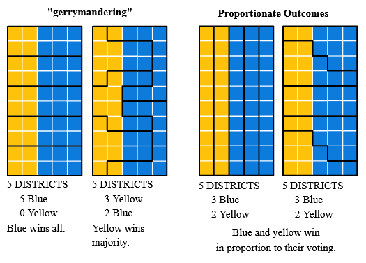
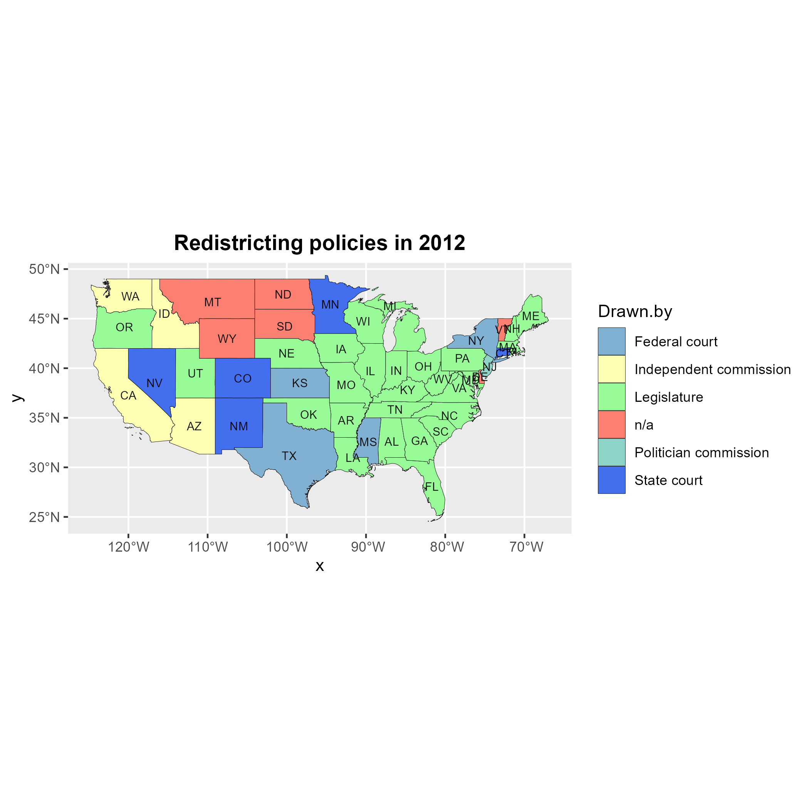
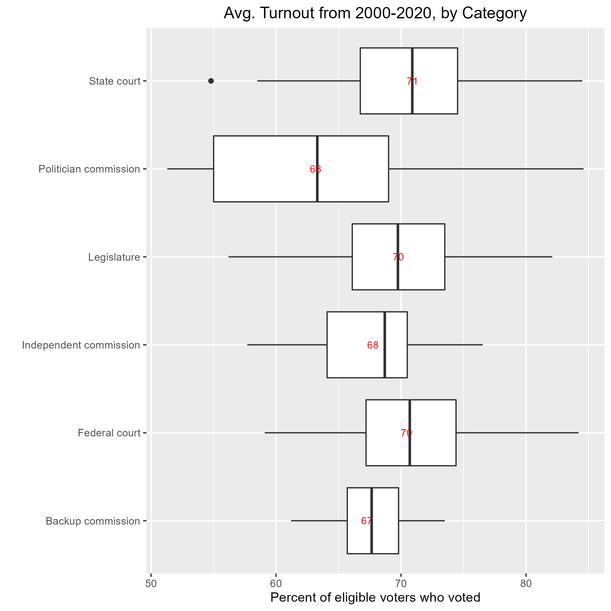
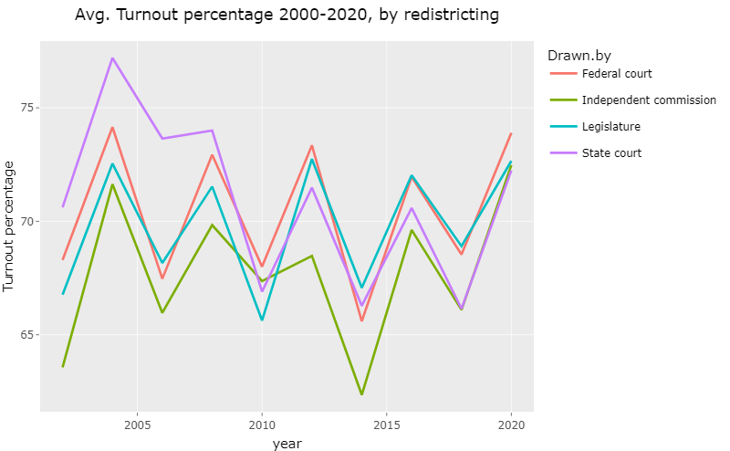
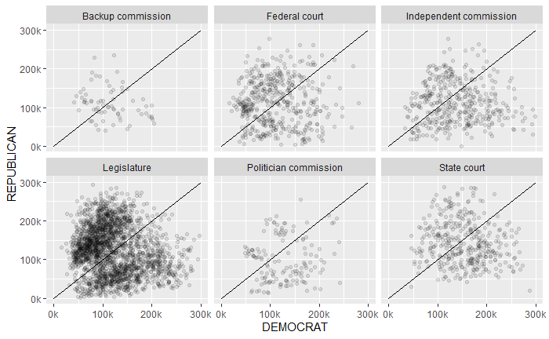

## Intro: Redistricting vs. Gerrymandering  {.build}

> - **Redistricting**:

-   Part of the constitution, designed to ensure fair representation
-   Based on results of decennial census
-   All states with more than 1 district redraw their maps
-   Traditionally done by state legislatures
-   Generally speaking, vote share should be close to seat share

 

> - **Gerrymandering**:

-   Almost as old as the constitution itself
-   Drawing districts in peculiar ways to gain political advantage
-   Party in power can entrench itself to maintain power

## Gerrymandering Examples

{width=25% height=20%}

Example Districts (40% Yellow Voters, 60% Blue Voters):

## 

 
(source: DavesRedistricting.org)

## Research questions  {.build}

\

- **Is there a statistically significant relationship between the redistricting institution and turnout in Congressional elections? Specifically, do partisan methods lead to lower turnout?**

\

- **Do partisan redistricting methods lead to more lopsided races - larger vote margins?**

  

## Redistricting institutions: Types {.build} 

\

- **Redistricting** - Redrawing of legislative district lines following the census in order to accommodate population shifts and keep districts as equal as possible.

- Each state has its own institution for drawing new congressional districts after a census:

-  Legislature

 -  Commission (politican, independent, backup)

 -  Courts (Federal, State)

 -  Exceptions (single-district states)

- **Partisan** (State legislatures or politicians) or **non-partisan** (more independent 3rd parties)

## State-wise redistricting policies

- Legislative redistricting is the most common.

{width=75%}

## Background and Hypothesis  {.build}
\

- **Prior research**:

  - Higher turnout for some groups when assigned to ethnic majority districts (Fraga, 2016)

  - Negative effects of redistricting in participation among African Americans (Hayes and Mckee (2011)
  - Higher turnout for individuals in if district aligned with partisanship (Fraga et al, 2022)
  
  -   Independent (non-partisan) commissions produce 'fairer' maps, compared to other commissions (Best and Lem, 2021; Lowenthal 2019)

-   **Hypothesis**: Nonpartisan redistricting methods - fairer maps - higher turnout

## Data Sources  {.build}

- **Redistricting policies by state, 2000-2020**

-   Loyola Law School
-   State-level, information about each state's redistricting method 
-   Variables: State, year, redistricting institution, date of adoption

- **US Census - electoral turnout**

-   US Census Bureau: Voter registration and turnout, 1972-2020
-   State-level
-   Variables: Eligible voters in each election, Year
    
- **Congressional election data, 2000-2020**

    -   MIT Election Lab Level
    -   District-level
    -   Variables: vote totals for each candidate/party, year
    
    

## Data cleaning and merging  {.build}

-  Drop with states with only one district (AK, DE, MT, ND, SD, VT, WY). Restrict to 2000-2020 range.

-  **Redistricting data**: Identifying states that redrew their district maps between censuses.

-  **Turnout**: Locating required tables nested within 'printer-friendly' spreadsheet

-  **Merge** redistricting and turnout (one-to-one) on State-year pairs. Then merge this with district-votes

## Methods 

-   Visualization and descriptive analyses

-   OLS Regression: Turnout on policy

-   Panel regression: Include state and year fixed effects

## Descriptive: Boxplot 

{width=70%}

- Politician commission had the lowest mean. Next, legislature-drawn states saw the lowest turnout values.

- The lowest values of turnout are seen for partisan mechanisms.

## Descriptive: Trends through time

{width=70%}

- Visible decline in midterm elections.

## OLS Regression: Specification  

- For each observation (state-election), policy is an unordered categorical variable.

- We run a model with all observations, and include a dummy variable for midterm years. 

    $y_{i} = \beta_0 + \beta_1 Policy_{i} + \beta_2 Midterm_{i} + \epsilon_{i}$

- Then, run model separately for each sample (midterms vs presidential), without the midterm dummy.

## OLS Regression: Results

{width=70%}

 - Politician commission has significant negative coefficient, while State Court has significant positive effects.

## OLS Regression: Results

{width=70%}

> - Politican commission associated with most negative coefficient. Effects more negative for midterms.

## Panel regression: fixed effects  {.build}

- States and years have different characteristics that may affect the response variable (unobserved heterogeneity).

- Observations are correlated over time, error terms will be autocorrelated. Idiosyncratic effects with time.

- Panel model with fixed effects for the state and year variables.

  $y_{it} = \beta_{i} + \beta_1 Policy_{it} +  \beta_2 year_t + \epsilon_{it}$ 

\
  
- Where \
$y_{it} =$ Turnout percentage for state i in year t \
$x_{it} =$ Binary variable for policy (court, legislature or partisan) \
$\beta_{i} =$ Intercept/fixed effect for state i \
$year_t =$ Intercept/fixed effect for year t \
$\epsilon_{it} =$ Error term
      
      
## Panel regression: results {.build}

{width=50%}

- Partisan redistricting mechanisms associated with lower turnout, court with higher. 

- Robust to state and year effects.

- Goodness of fit for fixed-effect models needs to be calculated separately. (Endsley 2016)

## Exploring vote margins {.build}

- The following plots Republican vs Democratic Votes for each district from 2000-2020, faceted by redistricting policy of the state.

{width=80%}

## Vote margins: Distribution

- We calculate the Democratic vote margin (in percent).

- Histogram for states with Legislature redistricting - bimodal distribution.

{width=80%}

## Limitations and next steps

-  Control variables, like demographics. 

-  District-level analysis.

-  Stronger causal inference methods, like difference-in-differences.
